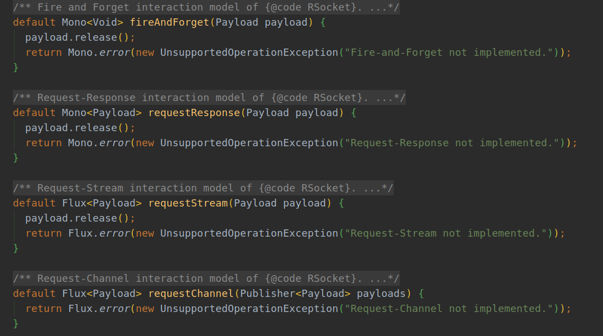
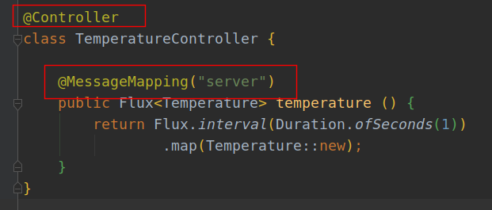
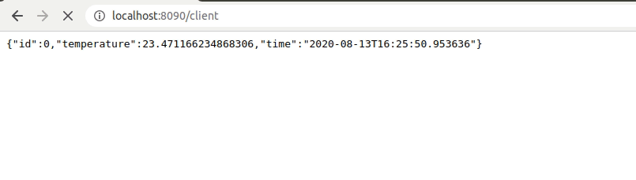

# Spring WebFlux (6):  RSocket 服务实现


RSocket官网：https://rsocket.io/


RSocket是一种二进制协议，可用于字节流传输，例如TCP，WebSockets和Aeron。

提供了四中交互模式：

- request/response (stream of 1)  请求/响应（单响应）大多数请求就是这种模式，仅1个响应的流，是在单个连接上多路复用的异步消息
- request/stream (finite stream of many)  可以将其视为“集合”或“列表”响应，但不是将所有数据作为单个响应返回，而是按顺序流回每个元素。
- fire-and-forget (no response)  无返回，在不需要响应时非常有用。它不仅可以通过跳过响应来节省网络使用量，而且可以在客户端和服务器处理时间内进行重大的性能优化，因为不需要簿记来等待和关联响应或取消请求。适用于可以有丢失的场景（非关键日子记录）
- channel (bi-directional streams)  双向消息流，用于源数据更新，断开连接等，可以获取订阅更新后的差额而不是重新获取一遍



它支持会话恢复，以允许跨不同的传输连接恢复长寿命的流。当网络连接频繁断开，切换和重新连接时，这对于移动服务器通信特别有用。


Springboot对RSocket进行了封装`MessagingRSocket`，通过Message进行传递，依赖如下：

```java
implementation 'org.springframework.boot:spring-boot-starter-rsocket'
```


## 应用示例

简单实现rsocket连接示例，设置一个服务端一个客户端，服务端实现server接口提供服务，客户端接收服务端信息，并通过RESTful访问数据在浏览器中显示

### 1. 创建服务端

+ 简单实现一个记录温度的类

```java
@Data
@NoArgsConstructor
@AllArgsConstructor
@Builder
class Temperature {
    Long id;
    Double temperature;
    LocalDateTime time;

    public Temperature (long id) {
        this.id = id;
        this.temperature = ThreadLocalRandom.current().nextDouble(20.0,35.0);
        this.time = LocalDateTime.now();
    }
}
```

+ 实现一个服务接口
+ 注意标红处跟RESTful类controller写法的不同



+ 设置rsocket服务端口：

```
spring.rsocket.server.port=8081
```

### 2. 客户端配置

+ 温度容器类：

```java
@Data
@NoArgsConstructor
@AllArgsConstructor
@Builder
class Temperature {
    Long id;
    Double temperature;
    LocalDateTime time;
}
```

+ 连接接口：

```java
interface Client {
    Flux<Temperature> temperature ();
}
```

+ 通过连接接口实现服务

```java
@Service
@RequiredArgsConstructor
class RSocketClient implements Client {

    private final RSocketRequester rSocketRequester;

    public Flux<Temperature> temperature () {
        return rSocketRequester.route("server")
                .retrieveFlux(Temperature.class);
    }
}
```

+ 通过RESTful controller调用服务

```java
@RestController
@RequiredArgsConstructor
@RequestMapping("client")
class RSocketClientController {

    private final RSocketClient rSocketClient;

    @GetMapping(produces = MediaType.APPLICATION_STREAM_JSON_VALUE)
    public Flux<Temperature> temperature() {
        return rSocketClient.temperature();
    }
}
```

+ 配置访问路径：

```java
@Configuration
class ClientConfiguration {
    @Bean
    public Client client (RSocketRequester rSocketRequester) {
        return new RSocketClient(rSocketRequester);
    }

    @Bean
    public RSocketRequester rSocketRequester (RSocketRequester.Builder builder) {
        return builder.connectTcp("localhost", 8081).block();
    }
}
```

### 3. 运行测试

+ 访问`http://localhost:8090/client`
+ rSocketClient连接`connectTcp("localhost", 8081)`, 接收数据
+ 返回到浏览器



## 代码

### server

[github](https://github.com/ffzs/WebFlux_RSocket_server)
[gitee](https://gitee.com/ffzs/WebFlux_RSocket_server)

### client

[github](https://github.com/ffzs/WebFlux_RSocket_client)
[gitee](https://gitee.com/ffzs/WebFlux_RSocket_client)